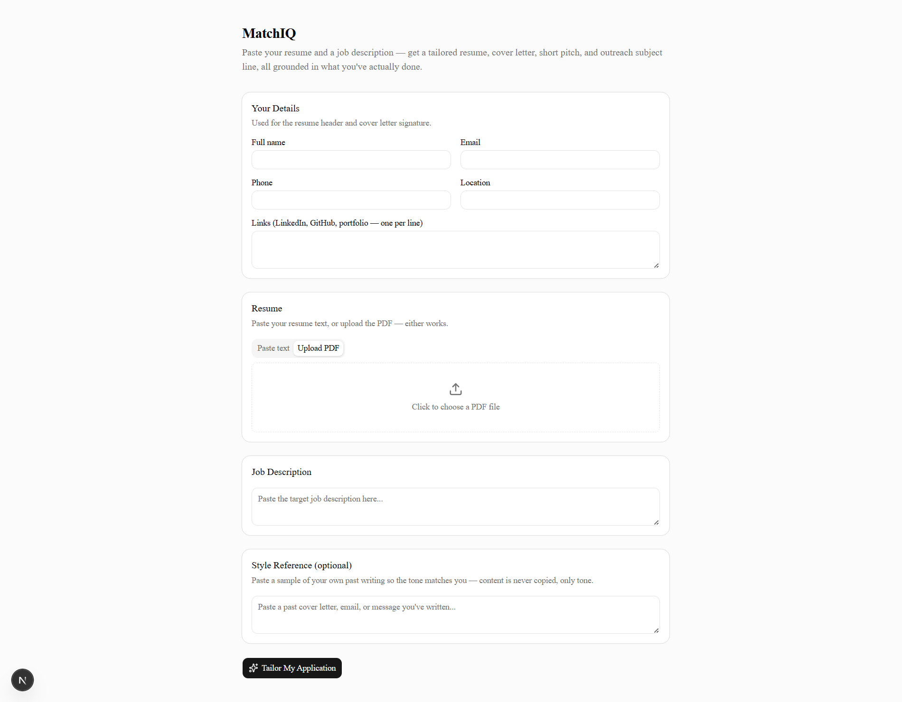

<div align="center">
  <h1>MatchIQ</h1>
  <p><strong>Turn your real experience into a focused job application.</strong></p>
  <p>MatchIQ uses your resume and a job description to create a tailored resume, cover letter, professional pitch, and outreach subject line—without inventing qualifications.</p>

  <p>
    
    
    
    
    
  </p>
</div>

## What it does

Give MatchIQ a resume and a job description. It identifies the most relevant parts of your background and produces application material tailored to that opportunity while keeping the content grounded in your supplied experience.

- Create a targeted resume for a specific role
- Generate a tailored cover letter
- Draft a concise professional pitch and outreach email subject line
- Upload a resume PDF or paste its text directly
- Autofill contact details from an uploaded resume PDF
- Download the generated resume and cover letter as PDFs
- Provide writing samples to guide the tone of the output

## How it looks

<div align="center">
  
</div>

## Tech stack

- Next.js 16 and React 19
- TypeScript
- Tailwind CSS 4
- Google Gemini API
- React PDF Renderer
- Zod

## Run locally

### Requirements

- Node.js 20 or newer
- A Google Gemini API key

### Setup

1. Clone the project and install dependencies.

   ```bash
   git clone https://github.com/Itzsoham/matchiq.git
   cd matchiq
   npm install
   ```

2. Create `.env.local` from the provided example.

   ```powershell
   Copy-Item .env.example .env.local
   ```

   On macOS or Linux:

   ```bash
   cp .env.example .env.local
   ```

3. Add your Gemini credentials to `.env.local`.

   ```env
   GEMINI_API_KEY=your-gemini-api-key
   GEMINI_MODEL=gemini-flash-latest
   ```

4. Start the development server.

   ```bash
   npm run dev
   ```

Visit [http://localhost:3000](http://localhost:3000) to use the app.

## Scripts

| Command | Purpose |
| --- | --- |
| `npm run dev` | Start the development server. |
| `npm run build` | Create a production build. |
| `npm run start` | Start the production server. |
| `npm run lint` | Run ESLint. |
| `npm run test:e2e` | Run Playwright end-to-end tests. |

---

Built to make job applications more specific, without making experience up.
